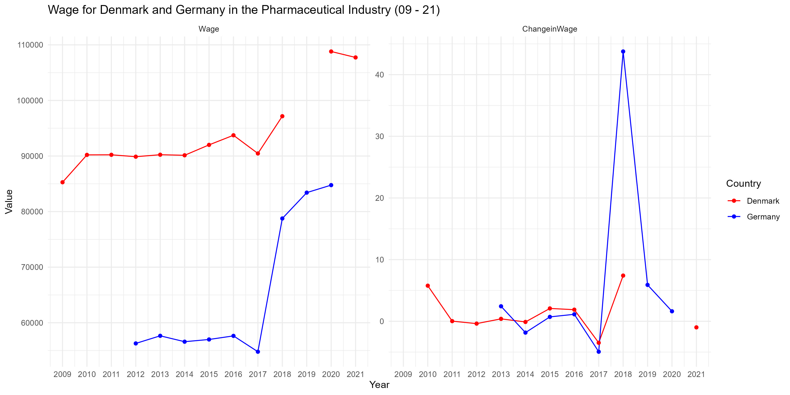
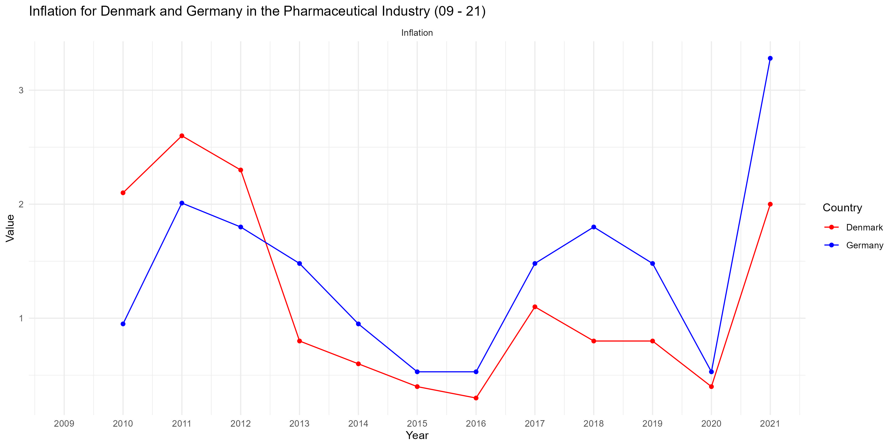
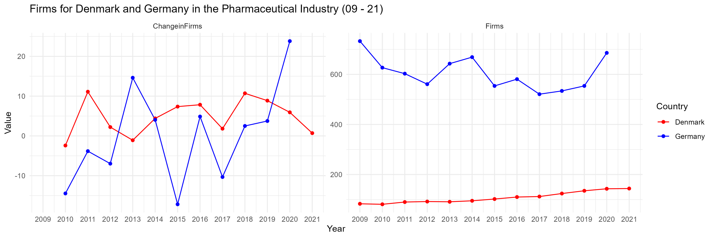
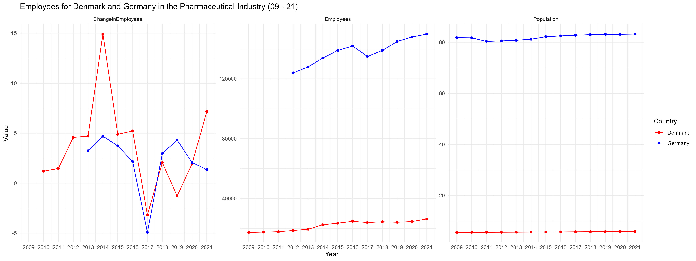
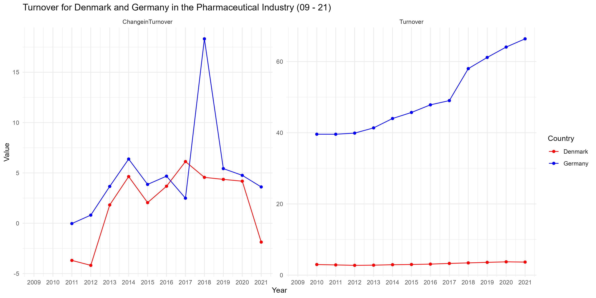
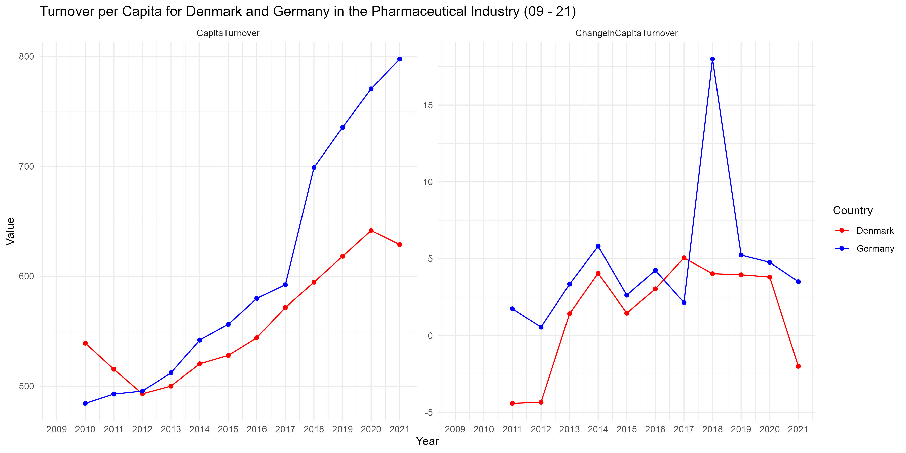
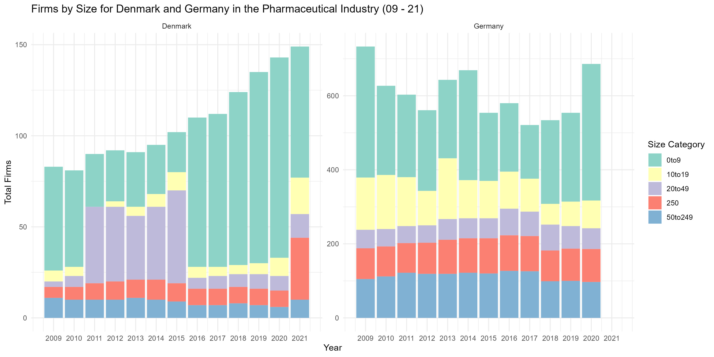
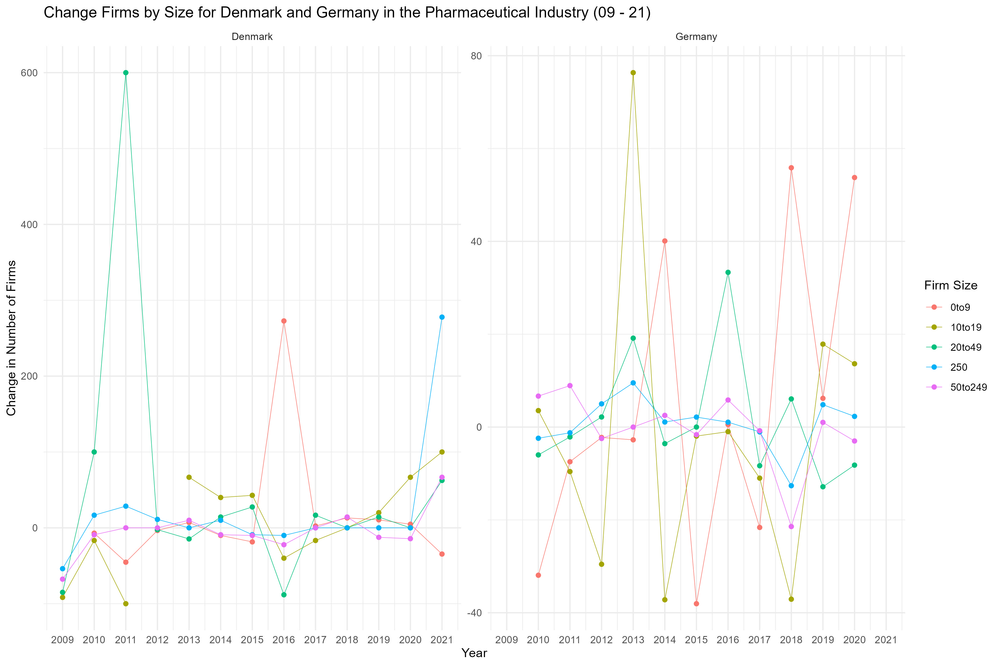

This repository serves to showcase my capabilities in R coding and small to medium code management. The code originated from a project where some colleagues and I analyzed data from the pharmaceutical industry from Denmark and Germany, between 2009 and 2021, reporting a comparison and evaluation of their performance. While my colleagues provided me the data, I was in charge of gathering, cleaning, analyzing and visualizing the data, controlling the quality of the output that would be used in said project. These visualizations would be shared to every project member, along with an interactive map for better understanding and interaction.

The data with which we assessed both industries contains information about their respective CPI's, number of employees, number of firms and their sizes, population, wages, and sales, all within the previously mentioned years. These data can be found inside the datasets inside the [Data folder](/Datasets/).

The cleaning, correction and visualization of the data was done in R Studio, but for the purpose of this repository, I will be using this markdown to demonstrate my abilities in R coding and data management. These first clumps of code can be found in the script [Data Collection Script.R](/Data%20Collection%20Script.R):

These libraries were used in the project:
```r
# Load necessary libraries
library(wooldridge) 
library(fixest)
library(tidyverse)
library(here)
library(readxl)
library(plotply)
library(htmlwidgets)

#If one intends to run the same code in R, run this first:
install.packages(c(
  "wooldridge",    # Econometrics Datasets
  "fixest",        # Fast Econometrics
  "tidyverse",     # Includes useful libraries, such as ggplot2
  "here",          # Easy File Paths
  "readxl",        # Read Excel Files
  "plotly",        # Interactive Plots
  "htmlwidgets",   # For Interactive Visualizations
))
```

To load the data and correct the variable names, eliminating inconsistencies for an easier merging:
```r
#Dataset Loading
Sales <- read_excel("Datasets/EUSales.xlsx")
Pop <- read_excel("Datasets/DKDEPopulation.xlsx")
CPI <- read_excel("Datasets/DKDECPI.xlsx")
Firms <- read_excel("Datasets/DKDEFirms.xlsx")
Size <- read_excel("Datasets/DKDESize.xlsx")
Employees <- read_excel("Datasets/DKDEEmployees.xlsx")
Wage <- read_excel("Datasets/DKDEWage.xlsx")

#Data Name Simplification
names(Sales)[names(Sales) == "time_period"] <- "Year"
names(Sales)[names(Sales) == "value"] <- "CapitaTurnover"
names(Sales)[names(Sales) == "country"] <- "Country"
names(Pop)[names(Pop) == "...1"] <- "Country"
names(CPI)[names(CPI) == "...1"] <- "Country"
names(Firms)[names(Firms) == "TIME"] <- "Country"
names(Employees)[names(Employees) == "...1"] <- "Country"
names(Wage)[names(Wage) == "TIME"] <- "Country"
```	

To filter to the indicated countries, pivot to fit formats, adjust values and merge into a single, general dataset:
```r
#Data Cleaning and Correction
Sales <- Sales %>%
  filter(Year != 2022,
         Country %in% c("Germany","Denmark"),
         drug_class == "Total", 
         unit_of_measure == "US dollars per person, PPP converted") %>%
         select(-measure, -unit_of_measure, -drug_class)

Pop <- Pop %>%
  pivot_longer(cols = -Country, 
               names_to = "Year", 
               values_to = "Population")

CPI <- CPI %>%
  pivot_longer(cols = -Country, 
               names_to = "Year", 
               values_to = "CPI")
CPI$CPI[CPI$Country == "Germany(2020)"] <- round(CPI$CPI[CPI$Country == "Germany(2020)"] * 100/94.5, 2)
CPI <- CPI %>%
  mutate(Country = str_remove(Country, "\\(.*\\)"))

Employees <- Employees %>%
  pivot_longer(cols = -Country, 
               names_to = "Year", 
               values_to = "Employees")
Employees <- Employees %>%
  mutate(Year = ifelse(Year == 20180, 2018, Year))

Firms <- Firms %>%
  pivot_longer(cols = -Country, 
               names_to = "Year", 
               values_to = "Firms")

Wage <- Wage %>% 
  mutate_all(as.character) %>%
  pivot_longer(cols = -Country, 
               names_to = "Year", 
               values_to = "Wage")
Wage$Wage <- as.numeric(Wage$Wage)

Turnover <- merge(Sales, Pop, by = c("Country", "Year"), all= TRUE)
Turnover <- merge(Turnover, CPI, by = c("Country", "Year"), all= TRUE)
Turnover$Turnover <- round((Turnover$CapitaTurnover*100/Turnover$CPI * Turnover$Population)/1000000000, 2) 
Turnover$CapitaTurnover <- round(Turnover$CapitaTurnover*100/Turnover$CPI, 2)

#Data Merge
Data <- merge(Turnover, Employees, by = c("Country", "Year"), all= TRUE)
Data <- merge(Data, Firms, by = c("Country", "Year"), all= TRUE)
Data <- merge(Data, Wage, by = c("Country", "Year"), all= TRUE)
rm(Sales, Pop, CPI, Employees, Firms, Turnover, Wage)
Data <- Data %>%
  group_by(Country) %>%
  mutate(Inflation = CPI - lag(CPI)) %>%
  ungroup()

Data$Wage <- round((Data$Wage*1000000/Data$Employees)*100/Data$CPI, 2)
```

Next, to make sure every variable is identified with the right vector:
```r
#Data Vector Classification
Data <- Data %>%
  mutate(across(c(Year, Country), 
         as.character),
         across(c(CapitaTurnover, Population, CPI, Turnover, Employees, Firms, Wage, Inflation),
         as.numeric))

Size <- Size %>%
  mutate(across(c(Year, Country, Size), 
         as.character),
         across(c(FirmsBySize), 
         as.numeric))
```

This code outputs the Dataset "Data" (from here onwards, every empty cell is due to a missing value, which represented a limitation of our report):

| Country | Year | CapitaTurnover | Population | CPI   | Turnover | Employees | Firms | Wage      | Inflation           |
|---------|------|----------------|------------|-------|----------|-----------|-------|-----------|---------------------|
| Denmark | 2009 |                | 5511451    | 91.2  |          | 17371     | 83    | 85277.74  |                     |
| Denmark | 2010 | 539.12         | 5534738    | 93.3  | 2.98     | 17579     | 81    | 90200.68  | 2.1   |
| Denmark | 2011 | 515.33         | 5560628    | 95.9  | 2.87     | 17838     | 90    | 90216.42  | 2.67   |
| Denmark | 2012 | 492.97         | 5580516    | 98.2  | 2.75     | 18653     | 92    | 89877.05  | 2.3   |
| Denmark | 2013 | 500            | 5602628    | 99    | 2.8      | 19529     | 91    | 90231     | 0.8  |
| Denmark | 2014 | 520.28         | 5627235    | 99.6  | 2.93     | 22443     | 95    | 90130.16  | 0.6  |
| Denmark | 2015 | 527.9          | 5659715    | 100   | 2.99     | 23540     | 102   | 92000.85  | 0.4  |
| Denmark | 2016 | 543.97         | 5707251    | 100.3 | 3.1      | 24768     | 110   | 93731.24  | 0.3  |
| Denmark | 2017 | 571.5          | 5748769    | 101.4 | 3.29     | 23977     | 112   | 90458.98  | 1.1   |
| Denmark | 2018 | 594.52         | 5781190    | 102.2 | 3.44     | 24472     | 124   | 97159.64  | 0.8  |
| Denmark | 2019 | 618.06         | 5806081    | 103   | 3.59     | 24156     | 135   |           | 0.8  |
| Denmark | 2020 | 641.59         | 5822763    | 103.4 | 3.74     | 24621     | 143   | 108806.17 | 0.4  |
| Denmark | 2021 | 628.75         | 5840045    | 105.4 | 3.67     | 26385     | 144   | 107731.85 | 2                  |
| Germany | 2009 |                | 81802257   | 92.28 |          |           | 733   |           |                     |
| Germany | 2010 | 484.29         | 81751602   | 93.23 | 39.59    |           | 627   |           | 0.95  |
| Germany | 2011 | 492.76         | 80327900   | 95.24 | 39.58    |           | 603   |           | 2.01   |
| Germany | 2012 | 495.47         | 80523746   | 97.04 | 39.9     | 124000    | 561   | 56279.59  | 1.8   |
| Germany | 2013 | 512.08         | 80767463   | 98.52 | 41.36    | 128000    | 643   | 57648.51  | 1.48    |
| Germany | 2014 | 541.87         | 81197537   | 99.47 | 44       | 134000    | 669   | 56590.23  | 0.95  |
| Germany | 2015 | 556.1          | 82175684   | 100   | 45.7     | 139000    | 554   | 56989.93  | 0.53  |
| Germany | 2016 | 579.73         | 82521653   | 100.53 | 47.84    | 142000    | 581   | 57635.38  | 0.53  |
| Germany | 2017 | 592.2          | 82792351   | 102.01 | 49.03    | 135000    | 521   | 54786.93  | 1.48   |
| Germany | 2018 | 698.78         | 83019213   | 103.81 | 58.01    | 139000    | 534   | 78760.38  | 1.8   |
| Germany | 2019 | 735.4          | 83166711   | 105.29 | 61.16    | 145000    | 554   | 83410.35  | 1.48   |
| Germany | 2020 | 770.46         | 83155031   | 105.82 | 64.07    | 148000    | 686   | 84762.75  | 0.53  |
| Germany | 2021 | 797.53         | 83237124   | 109.1 | 66.38    | 150000    |       |           | 3.28   |


And the Dataset "Size" (Firms by Size was separated due to it including the variable "Size", since merging this data with the rest would've been be too troublesome when visualizing, both in a graph and in a table):

| Country | Year | Size    | FirmsBySize |
|---------|------|---------|-------------|
| Denmark | 2009 | 0to9    | 57          |
| Denmark | 2009 | 10to19  | 6           |
| Denmark | 2009 | 20to49  | 3           |
| Denmark | 2009 | 50to249 | 11          |
| Denmark | 2009 | 250     | 6           |
| Denmark | 2010 | 0to9    | 53          |
| Denmark | 2010 | 10to19  | 5           |
| Denmark | 2010 | 20to49  | 6           |
| Denmark | 2010 | 50to249 | 10          |
| Denmark | 2010 | 250     | 7           |
| Denmark | 2011 | 0to9    | 29          |
| Denmark | 2011 | 10to19  | 0           |
| Denmark | 2011 | 20to49  | 42          |
| Denmark | 2011 | 50to249 | 10          |
| Denmark | 2011 | 250     | 9           |
| Denmark | 2012 | 0to9    | 28          |
| Denmark | 2012 | 10to19  | 3           |
| Denmark | 2012 | 20to49  | 41          |
| Denmark | 2012 | 50to249 | 10          |
| Denmark | 2012 | 250     | 10          |
etc.


We were not only interested in the values themselves, but also the annual changes between the data, which would bring a better understanding of their performances:

```r
#Indexation
DataChange <- Data %>%
  group_by(Country) %>%
  mutate(ChangeinCapitaTurnover = round((CapitaTurnover-lag(CapitaTurnover))*100/lag(CapitaTurnover),2),
         ChangeinPopulation = round((Population-lag(Population))*100/lag(Population),2),
         ChangeinTurnover = round((Turnover-lag(Turnover))*100/lag(Turnover),2),
         ChangeinEmployees = round((Employees-lag(Employees))*100/lag(Employees),2),
         UnitChangeinFirms = Firms-lag(Firms),
         ChangeinFirms = round((Firms-lag(Firms))*100/lag(Firms),2),
         ChangeinWage = round((Wage-lag(Wage))*100/lag(Wage),2)) %>%
  ungroup() %>%
  select(-CPI)

SizeChange <- Size %>%
  arrange(Size)%>%
  group_by(Country) %>%
  mutate(ChangeinFirmsBySize = round((FirmsBySize-lag(FirmsBySize))*100/lag(FirmsBySize),2),
         ChangeinFirmsBySize = ifelse(is.infinite(ChangeinFirmsBySize), NA, ChangeinFirmsBySize))
```

The following code can be found in the script [Graph Script.R](Graph%20Script.R). The code contains the graph creation, and their respective output (graph in .jgp format and interactive graph in .html format). These graphs can be found in the ["Data" folder](/Data/):

Wage and Change in Wage Graph:
```r
#Graph Creation
Graph1 <- DataChange %>%
  select(Country, Year, ChangeinWage, Wage) %>%
  pivot_longer(cols = c(ChangeinWage, Wage),
               names_to = "Metric",
               values_to = "Value") %>% 
  mutate(Year = as.numeric(Year),
         Metric = factor(Metric, levels = c("Wage", "ChangeinWage")))  
Wage <- ggplot(Graph1, aes(x = Year, y = Value, color = Country)) +
  geom_line(na.rm = TRUE) +
  geom_point(na.rm = TRUE) +
  facet_wrap(~Metric, scales = "free_y", nrow = 1) +
  labs(title = "Wage for Denmark and Germany in the Pharmaceutical Industry (09 - 21)",
       y = "Value",
       color = "Country") +
  theme_minimal() +
  scale_color_manual(values = c("Denmark" = "red", "Germany" = "blue")) +
  scale_x_continuous(breaks = unique(Graph1$Year))

#Output
ggsave("C:/Users/Usuario/Documents/2nD Desktop/BE Project - VS Code/Data/Wage.jpg", 
       plot = Wage,
       width = 12, height = 6, dpi = 300)
IWage <- ggplotly(Wage)
saveWidget(widget = IWage,
           file = "C:/Users/Usuario/Documents/2nD Desktop/BE Project - VS Code/Data/Wage.html",
           selfcontained = TRUE)
```
Output:

[Interactive Graph](Data/Wage.html)

```r
#Graph Creation
Graph2 <- DataChange %>%
  select(Country, Year, Inflation) %>%
  pivot_longer(cols = c(Inflation),
               names_to = "Metric",
               values_to = "Value") %>% 
  mutate(Year = as.numeric(Year)) 
Inflation <- ggplot(Graph2, aes(x = Year, y = Value, color = Country)) +
  geom_line(na.rm = TRUE) +
  geom_point(na.rm = TRUE) +
  facet_wrap(~Metric, scales = "free_y", nrow = 1) +
  labs(title = "Inflation for Denmark and Germany in the Pharmaceutical Industry (09 - 21)",
       y = "Value",
       color = "Country") +
  theme_minimal() +
  scale_color_manual(values = c("Denmark" = "red", "Germany" = "blue")) +
  scale_x_continuous(breaks = unique(Graph2$Year))

#Output
ggsave("C:/Users/Usuario/Documents/2nD Desktop/BE Project/Data/Inflation.jpg", 
       plot = Inflation,
       width = 12, height = 6, dpi = 300)
IInflation <- ggplotly(Inflation)
saveWidget(widget = IInflation,
           file = "C:/Users/Usuario/Documents/2nD Desktop/BE Project/Data/Inflation.html",
           selfcontained = TRUE)
```
Output:

[Interactive Graph](Data/Inflation.html)

```r
#Graph Creation
Graph3 <- DataChange %>%
  select(Country, Year, Firms, ChangeinFirms) %>%
  pivot_longer(cols = c(Firms, ChangeinFirms),
               names_to = "Metric",
               values_to = "Value") %>% 
  mutate(Year = as.numeric(Year))
Firms <- ggplot(Graph3, aes(x = Year, y = Value, color = Country)) +
  geom_line(na.rm = TRUE) +
  geom_point(na.rm = TRUE) +
  facet_wrap(~Metric, scales = "free_y", nrow = 1) +
  labs(title = "Firms for Denmark and Germany in the Pharmaceutical Industry (09 - 21)",
       y = "Value",
       color = "Country") +
  theme_minimal() +
  scale_color_manual(values = c("Denmark" = "red", "Germany" = "blue")) +
  scale_x_continuous(breaks = unique(Graph3$Year))

#Output
ggsave("C:/Users/Usuario/Documents/2nD Desktop/BE Project/Data/Firms.jpg", 
       plot = Firms,
       width = 12, height = 4, dpi = 300)
IFirms <- ggplotly(Firms)
saveWidget(widget = IFirms,
           file = "C:/Users/Usuario/Documents/2nD Desktop/BE Project/Data/Firms.html",
           selfcontained = TRUE)
```
Output:

[Interactive Graph](Data/Firms.html)
```r
#Graph Creation
Graph4 <- DataChange %>%
  select(Country, Year, Employees, ChangeinEmployees, Population) %>%
  mutate(Population = Population/1000000) %>%
  pivot_longer(cols = c(Employees, ChangeinEmployees, Population),
               names_to = "Metric",
               values_to = "Value") %>% 
  mutate(Year = as.numeric(Year))
Employees <- ggplot(Graph4, aes(x = Year, y = Value, color = Country)) +
  geom_line(na.rm = TRUE) +
  geom_point(na.rm = TRUE) +
  facet_wrap(~Metric, scales = "free_y", nrow = 1) +
  labs(title = "Employees for Denmark and Germany in the Pharmaceutical Industry (09 - 21)",
       y = "Value",
       color = "Country") +
  theme_minimal() +
  scale_color_manual(values = c("Denmark" = "red", "Germany" = "blue")) +
  scale_x_continuous(breaks = unique(Graph4$Year))

#Output
ggsave("C:/Users/Usuario/Documents/2nD Desktop/BE Project/Data/Employees.jpg", 
       plot = Employees,
       width = 16, height = 6, dpi = 300)
IEmployees <- ggplotly(Employees)
saveWidget(widget = IEmployees,
           file = "C:/Users/Usuario/Documents/2nD Desktop/BE Project/Data/Employees.html",
           selfcontained = TRUE)
```
Output:

[Interactive Graph](Data/Employees.html)
```r
#Graph Creation
Graph5 <- DataChange %>%
  select(Country, Year, Turnover, ChangeinTurnover) %>%
  pivot_longer(cols = c(Turnover, ChangeinTurnover),
               names_to = "Metric",
               values_to = "Value") %>% 
  mutate(Year = as.numeric(Year))
Turnover <- ggplot(Graph5, aes(x = Year, y = Value, color = Country)) +
  geom_line(na.rm = TRUE) +
  geom_point(na.rm = TRUE) +
  facet_wrap(~Metric, scales = "free_y", nrow = 1) +
  labs(title = "Turnover for Denmark and Germany in the Pharmaceutical Industry (09 - 21)",
       y = "Value",
       color = "Country") +
  theme_minimal() +
  scale_color_manual(values = c("Denmark" = "red", "Germany" = "blue")) +
  scale_x_continuous(breaks = unique(Graph5$Year))

#Output
ggsave("C:/Users/Usuario/Documents/2nD Desktop/BE Project/Data/Turnover.jpg", 
       plot = Turnover,
       width = 12, height = 6, dpi = 300)
ITurnover <- ggplotly(Turnover)
saveWidget(widget = ITurnover,
           file = "C:/Users/Usuario/Documents/2nD Desktop/BE Project/Data/Turnover.html",
           selfcontained = TRUE)
```
Output:

[Interactive Graph](Data/Turnover.html)
```r
#Graph Creation
Graph6 <- DataChange %>%
  select(Country, Year, CapitaTurnover, ChangeinCapitaTurnover) %>%
  pivot_longer(cols = c(CapitaTurnover, ChangeinCapitaTurnover),
               names_to = "Metric",
               values_to = "Value") %>% 
  mutate(Year = as.numeric(Year))
CapitaTurnover <- ggplot(Graph6, aes(x = Year, y = Value, color = Country)) +
  geom_line(na.rm = TRUE) +
  geom_point(na.rm = TRUE) +
  facet_wrap(~Metric, scales = "free_y", nrow = 1) +
  labs(title = "Turnover per Capita for Denmark and Germany in the Pharmaceutical Industry (09 - 21)",
       y = "Value",
       color = "Country") +
  theme_minimal() +
  scale_color_manual(values = c("Denmark" = "red", "Germany" = "blue")) +
  scale_x_continuous(breaks = unique(Graph6$Year))

#Output
ggsave("C:/Users/Usuario/Documents/2nD Desktop/BE Project/Data/CapitaTurnover.jpg", 
       plot = CapitaTurnover,
       width = 12, height = 6, dpi = 300)
ICapitaTurnover <- ggplotly(CapitaTurnover)
saveWidget(widget = ICapitaTurnover,
           file = "C:/Users/Usuario/Documents/2nD Desktop/BE Project/Data/CapitaTurnover.html",
           selfcontained = TRUE)
```
Output:

[Interactive Graph](Data/CapitaTurnover.html)
```r
#Graph Creation
Graph7 <- Size %>%
  mutate(Year = as.numeric(Year))
Size1 <- ggplot(Graph7, aes(x = Year, y = FirmsBySize, fill = Size)) +
  geom_col(position = "stack") +
  facet_wrap(~Country, nrow = 1, scales = "free_y") +
  labs(title = "Firms by Size for Denmark and Germany in the Pharmaceutical Industry (09 - 21)",
      y = "Total Firms",
      fill = "Size Category") +
  theme_minimal() +
  scale_fill_brewer(palette = "Set3") +
  scale_x_continuous(breaks = unique(Graph7$Year))

#Output
ggsave("C:/Users/Usuario/Documents/2nD Desktop/BE Project/Data/Size.jpg", 
       plot = Size1,
       width = 12, height = 6, dpi = 300)
ISize1 <- ggplotly(Size1)
saveWidget(widget = ISize1,
           file = "C:/Users/Usuario/Documents/2nD Desktop/BE Project/Data/Size1.html",
           selfcontained = TRUE)
```
Output:

[Interactive Graph](Data/Size1.html)
```r
#Graph Creation
Graph8 <- SizeChange %>%
  select(Country, Year, Size, ChangeinFirmsBySize) %>%
  mutate(Year = as.numeric(Year))
Size2 <- ggplot(Graph8, aes(x = Year, y = ChangeinFirmsBySize, color = Size, group = Size)) +
  geom_line(linewidth = 0.2) +
  geom_point() +
  facet_wrap(~Country, nrow = 1, scales = "free_y") +
  labs(title = "Change Firms by Size for Denmark and Germany in the Pharmaceutical Industry (09 - 21)",
       x = "Year",
       y = "Change in Number of Firms",
       color = "Firm Size") +
  theme_minimal() +
  scale_x_continuous(breaks = unique(Graph8$Year))

#Output
ggsave("C:/Users/Usuario/Documents/2nD Desktop/BE Project/Data/SizeChange.jpg", 
       plot = Size2,
       width = 12, height = 8, dpi = 300)
ISize2 <- ggplotly(Size2)
saveWidget(widget = ISize2,
           file = "C:/Users/Usuario/Documents/2nD Desktop/BE Project/Data/Size2.html",
           selfcontained = TRUE)
```
Output:

[Interactive Graph](Data/Size2.html)